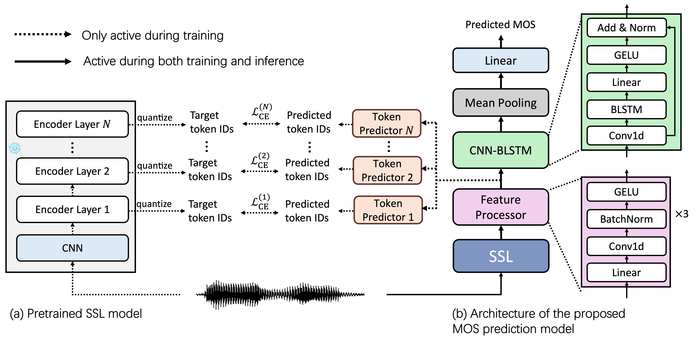

# DistilMOS

Official implementation of **[DistilMOS: Layer-wise Self-distillation for Self-Supervised Learning Model-based MOS Prediction](https://arxiv.org/abs/2601.13700)**.  

## Overview

DistilMOS is a self-supervised learning (SSL) based Mean Opinion Score (MOS) prediction framework that leverages layer-wise self-distillation for robust speech quality estimation.




## Installation

```bash
git clone https://github.com/BaleYang/DistilMOS.git

cd DistilMOS

conda create -n distilmos python=3.10 -y
conda activate distilmos

pip install -r requirements.txt

```

## Inference

`predict.py` supports:
- single `wav` file inference
- directory inference (recursive, batch mode)
- backbone selection: `wavlm`(default) or `w2v2`

### Single File

```bash
python predict.py \
  --input /path/to/audio.wav \
  --ssl_backbone wavlm
```

### Directory (Batch)

```bash
python predict.py \
  --input /path/to/wav_dir \
  --ssl_backbone w2v2 \
  --batch_size 32 \
  --output /path/to/predictions.csv
```

